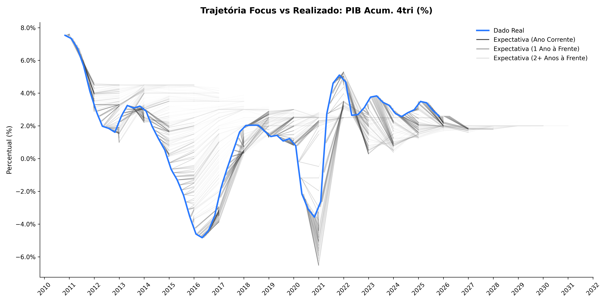
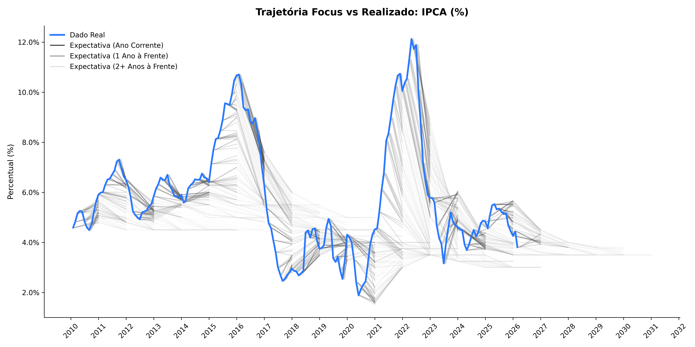
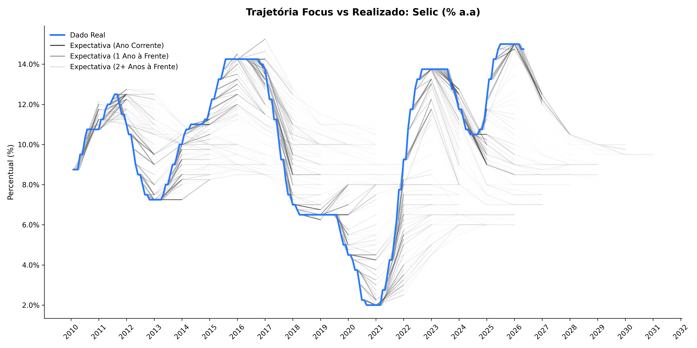
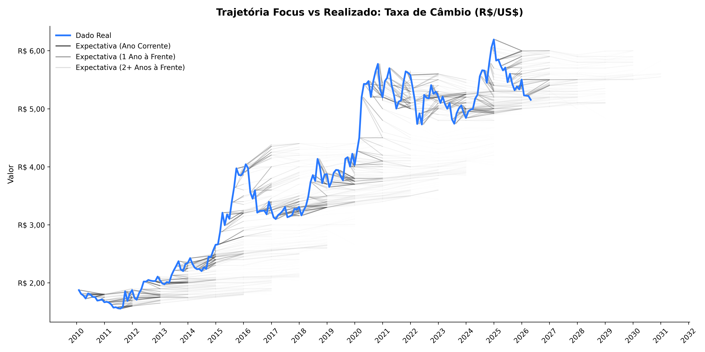

# 📈 Dashboard: Expectativas de Mercado (Focus/BCB)

**[👉 Acesse o Dashboard Interativo clicando aqui](https://galvd.github.io/focus_expectations/)**

**Última atualização:** 07/04/2026

Este painel estático apresenta as trajetórias das expectativas de mercado coletadas semanalmente pelo Banco Central do Brasil e expressadas pela medianda das expectativas das instituições financeiras consultadas.

## 📌 Painel Resumo: Últimos Valores e Tendências
*(Comparações referentes à semana anterior: ▲ Subiu, ▼ Desceu, = Manteve)*

| 🔹 PIB (série real suavizada) | 🔹 IPCA | 🔹 Taxa Selic | 🔹 Câmbio |
| :--- | :--- | :--- | :--- |
| **Dado Realizado:** **2,60%**  **2026:** 1,85% (=) **2027:** 1,80% (=) **2028:** 2,00% (=) | **Dado Realizado:** **3,81%**  **2026:** 4,36% (▲) **2027:** 3,85% (▲) **2028:** 3,60% (▲) | **Dado Realizado:** **14,75%**  **2026:** 12,50% (=) **2027:** 10,50% (=) **2028:** 10,00% (=) | **Dado Realizado:** **R$ 5,15**  **2026:** R$ 5,40 (=) **2027:** R$ 5,45 (▼) **2028:** R$ 5,50 (▼) |

---

## 📊 Expectativas sobre o PIB Anual (Série Suavizada)
Expectativas de crescimento do Produto Interno Bruto.

---

## 📈 Expectativas sobre a Inflação (IPCA)
Expectativas de inflação oficial (IPCA).

---

## 🏦 Expectativas sobre a Taxa Selic
Projeções para a taxa básica de juros da economia.

---

## 💵 Expectativas sobre a Taxa de Câmbio
Acompanhamento da trajetória esperada para a taxa de câmbio.

---

[← Voltar para o Perfil](https://github.com/galvd)
